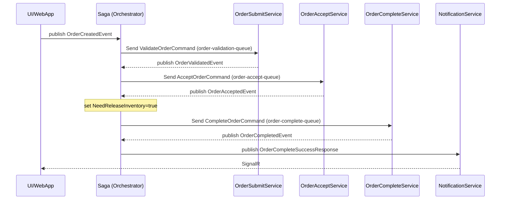
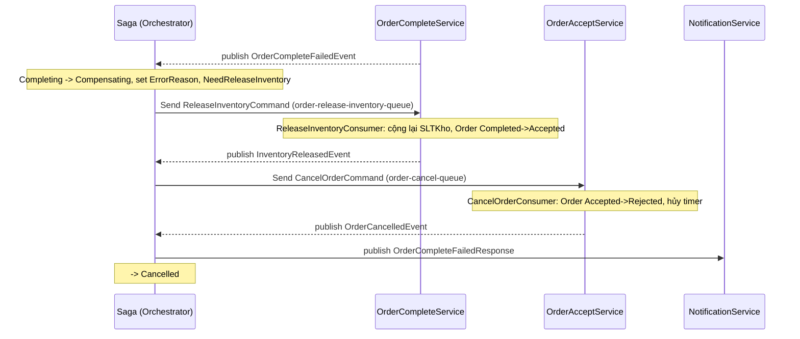
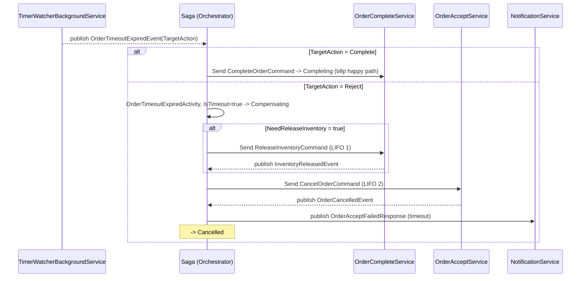
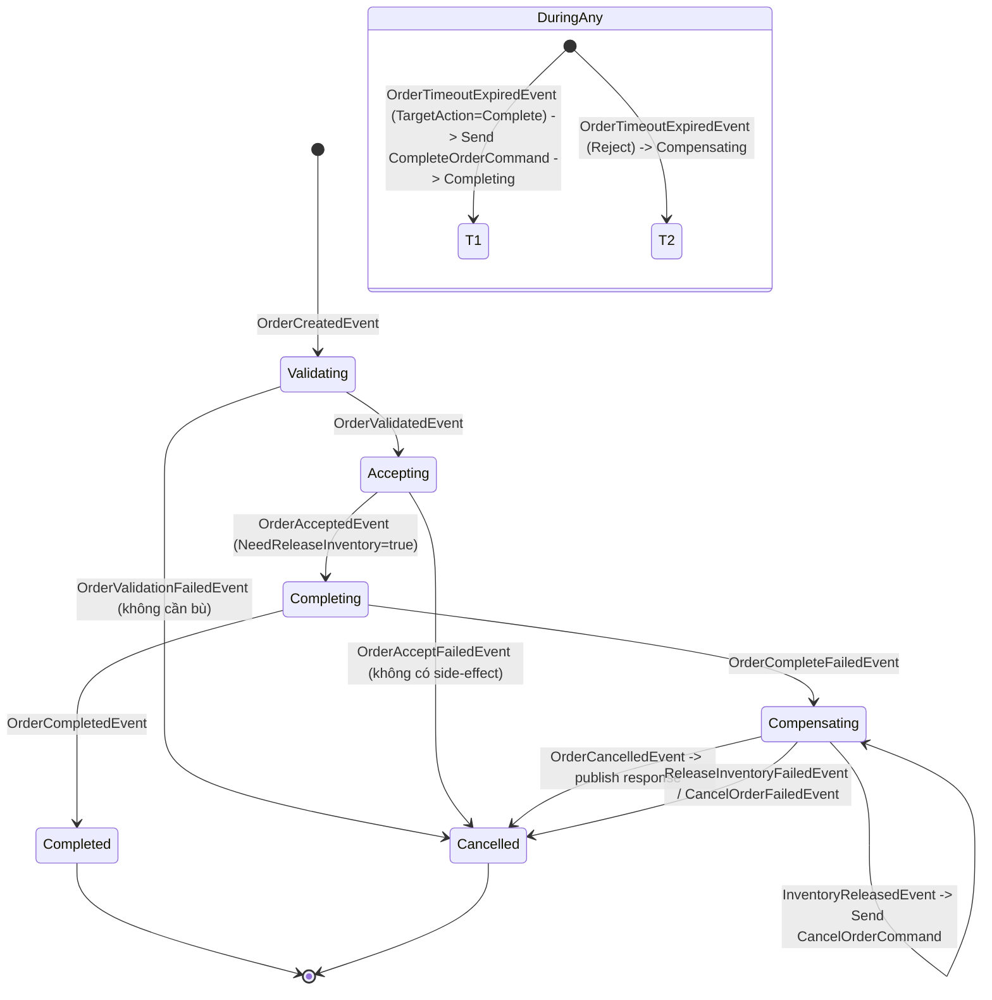

# Saga Flow — Order Orchestration

## 1) Happy path

## 2) Complete fail — bồi hoàn LIFO 2 bước

## 3) Timeout — Saga quyết định

## 4) State machine

## 5) Queue map

| Queue | Producer | Consumer |
|---|---|---|
| `order-validation-queue` | Saga (`OrderCreatedActivity`) | `OrderSubmitService` |
| `order-accept-queue` | Saga (`OrderValidatedActivity`) | `OrderAcceptService` |
| `order-complete-queue` | Saga (`OrderAcceptedActivity`, `OrderTimeoutCompleteActivity`) | `OrderCompleteService` |
| `order-release-inventory-queue` | Saga (`OrderCompleteFailedActivity`, `OrderTimeoutExpiredActivity`) | `OrderCompleteService` (`ReleaseInventoryConsumer`) |
| `order-cancel-queue` | Saga (`InventoryReleasedActivity`, `OrderTimeoutExpiredActivity`) | `OrderAcceptService` (`CancelOrderConsumer`) |
| `notification-queue` | Các luồng publish `*Response` | `NotificationService` |

## 6) Idempotency guard

| Consumer | Chỉ xử lý khi Order trạng thái |
|---|---|
| `OrderAcceptConsumer` | `Submitted` |
| `OrderCompleteConsumer` | `Accepted` |
| `ReleaseInventoryConsumer` | `Completed` |
| `CancelOrderConsumer` | `Accepted` |

---

# OVERVIEW: Nâng cấp MassTransit `8.5.7` → `9.2.0`

> Tóm tắt cho toàn repo: **không phải "nâng lên là vỡ ngay lập tức ở cấp biên dịch", nhưng có 3 nhóm vấn đề BẮT BUỘC xử lý:**
> ① **Giấy phép thương mại (Commercial License)** — v9 giờ là sản phẩm thương mại của cty Massient, yêu cầu license key (mã nguồn mở chính thức v8 kết thúc hỗ trợ sau 2026).
> ② **Thay đổi schema DB** (saga `OrderState`, bảng SQL transport, outbox) → phải chạy migration/hosted service tạo lại.
> ③ **Nâng cấp đồng bộ toàn bộ dịch vụ** cùng 1 phiên bản major, không được để server/choreography lẫn lộn v9/v8.

Các API dự án này đang dùng (`UsingRabbitMq`, `UsingPostgres`, `cfg.Host(...)`, `SqlTransportOptions`, `EntityFrameworkRepository(...)`, `IStateMachineActivity<TInstance,TMessage>`, `.Activity(x=>x.OfType<T>())`, `SagaClassMap`) **vẫn tồn tại trong tài liệu v9** → khả năng cao biên dịch được, nhưng vẫn cần `dotnet build` để soi lại.

---

# DETAILS: Từng thay đổi ảnh hưởng tới hệ thống hiện tại

## A. VỀ GIẤY PHÉP (BẬT ỨNG DỤNG)
| Vấn đề | 8.5.7 | 9.2.0 | Ảnh hưởng |
|---|---|---|---|
| License | Apache-2.0 mã nguồn mở, tự do | Thương mại (Massient), cần **license key**; `AddMassTransit` có validate license | Dev local có key eval miễn phí, nhưng **deploy production cần trả phí** (thấp nhất ~$400/tháng) |
| Hỗ trợ | còn bảo trì | v8 còn patch đến hết 2026 rồi EOL | Nếu ngân sách hạn chế, cân nhắc giữ v8 |

## B. TARGET FRAMEWORK
- v9 có target **`net10.0`** — khớp với các project của bạn (`TargetFramework=net10.0`). ✅ Không vấn đề.

## 3. API BỊ ĐỔI TÊN / GỠ (thấp khả năng trúng, đã kiểm tra dự án này KHÔNG dùng)
| Mục | Ghi chú | Trong repo? |
|---|---|---|
| `AddSendEndpointConvention` → `AddMessageRoute` (9.0.1) | không dùng | ❌ |
| `TransactionalBus` bị gỡ (9.2) | không dùng | ❌ |
| `IPublishEndpoint`/`ISendEndpointProvider` đổi routing ở MultiBus (9.2 breaking) | repo chỉ dùng **single bus** nên không ăn | ❌ |
| JSON serialize chuyển sang per-bus/endpoint (backward-compatible) | dùng dạng mặc định | ❌ |

## 4. SCHEMA DATABASE — **PHẢI XỬ LÝ**
- Changelog v9.1 ghi rõ: *"transactional outbox tables were updated; apply migrations before rollout"*.
- Bảng saga **`OrderState`** (EF): v9 có thể thêm column mới (VD `RowVersion`, `FaultMessage`, `RetryCount`…) → **phải regenerate EF migration** cho cả `OrderSagaDbContext`.
- SQL transport tự tạo schema/table/functions riêng (do `AutoStart` / hosted service tạo): nâng lên v9 nên dùng lại cơ chế tạo schema chuẩn mới.
- Khi có migration DB mới → cần làm `dotnet ef migrations add`/`database update` tương ứng cho cả **2 DbContext** (`ApplicationDbContext`, `IdentityContext`) và **saga DbContext** trước khi chạy.

## 5. CẤU HÌNH SQL TRANSPORT (các Consumer + WebApp)
- Hiện tại: `services.Configure<SqlTransportOptions>` + `cfg.AutoStart = true`.
- v9 khuyên dùng **`services.AddPostgresMigrationHostedService()` đặt TRƯỚC `AddMassTransit`** để tạo schema/tables trước khi bus start; `AutoStart` bị coi là deprecated.
- `SqlTransportOptions.ConnectionString` vẫn đúng chuẩn options pattern → giữ nguyên.

## 6. TƯƠNG THÍCH WIRE GIỮA CÁC SERVICE (QUAN TRỌNG)
- `OrderOrchestration` dùng transport **RabbitMQ** + saga EF; các Consumer (`OrderSubmit/Accept/Complete`, `NotificationService`) và `WebApp.Server` dùng transport **SQL Postgres** — message đi qua RabbitMQ và định dạng envelope khác nhau.
- Phải **nâng cả giải (toàn bộ project cùng lúc)**, không nâng lẻ. Nếu lẫn `lồng v8` (vd producer 9.2 gửi, consumer 8.5.7 nhận) → deserialize fail → message rơi vào `_error` queue → saga không hoàn tất.
- Kiểm tra lại bằng cách run cả stack từ A→Z (Happy path + Complete fail + Timeout) ngay sau khi build.

## 7. ĐỀ XUẤT CÁC BƯỚC LÀM AN TOÀN
1. Nhân bản/branch riêng, `dotnet restore` sau khi đổi version 9.2.0 ở 7 csproj (OrderOrchestration, OrderSubmit/Accept/Complete Service, NotificationService, Application, WebApp.Server).
2. `dotnet build` toàn solution → soi chỗ sai API (nếu có).
3. Cập license key (nếu production).
4. Tạo lại migrations saga/transport; `database update`.
5. Chạy toàn bộ stack, verify 4 kịch bản Happy path + 2 fail + timeout + check Saga `OrderState` gửi đúng.

## 8. BẢNG TỔNG HỢP TÁC ĐỘNG THEO PROJECT

| Project | Package (8.5.7) | Thay đổi API cơ bản? | Schema cần xử? |
|---|:---|:---:|:---:|
| `OrderOrchestration` | MassTransit, .EntityFrameworkCore, .SqlTransport.PostgreSQL | Saga repository / `UsingRabbitMq` OK | ✅ `OrderState` saga |
| `OrderSubmit/Accept/Complete Service` | MassTransit, .RabbitMQ, .SqlTransport.PostgreSQL | `UsingPostgres`, `AutoStart` (deprecated) | ✅ transport + outbox |
| `NotificationService` | MassTransit, .SqlTransport.PostgreSQL | `UsingPostgres`, `ReceiveEndpoint` OK | ✅ transport |
| `WebApp.Server` | MassTransit, .RabbitMQ, .EntityFrameworkCore, .SqlTransport.PostgreSQL | `SqlTransportOptions` OK | ✅ outbox |
| `Infrastructure.Persistence` | `OpenTelemetry.Instrumentation.MassTransit` (beta.3) | không phải package MassTransit, không cần nâng | - |
