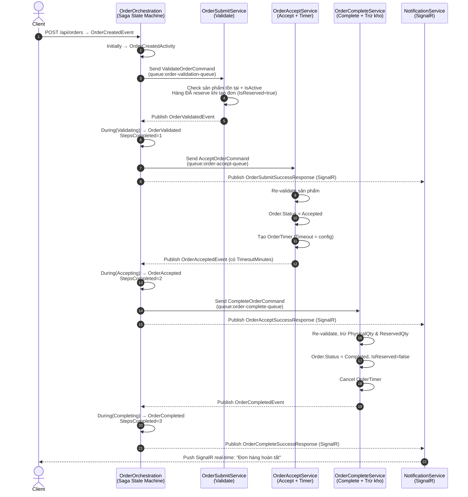
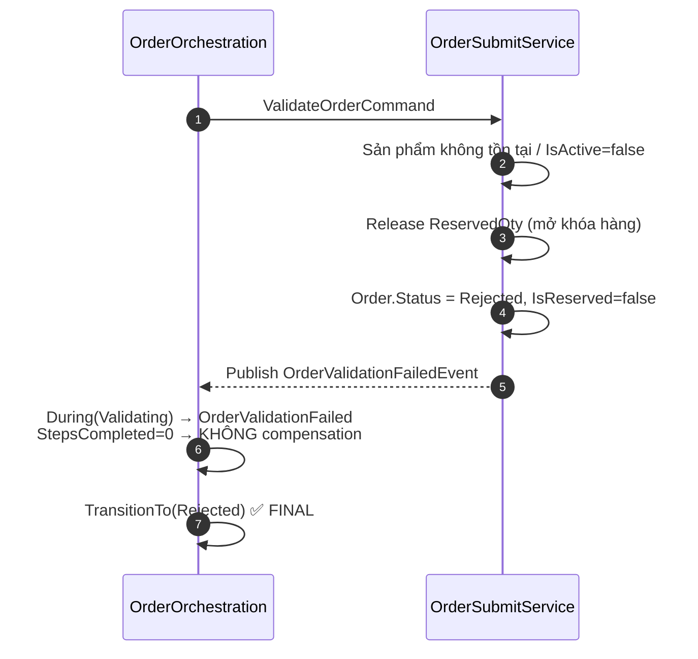
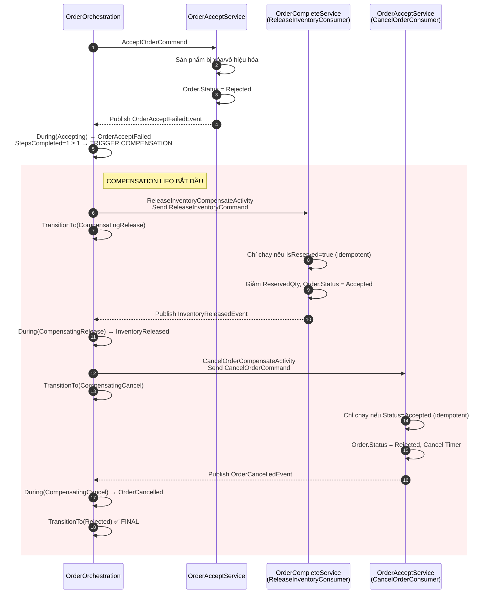
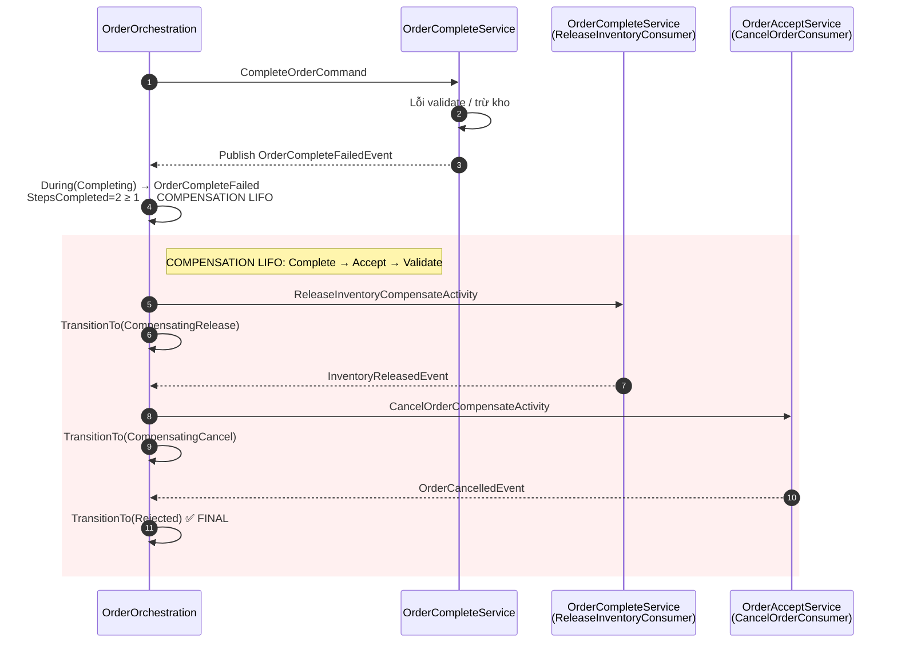
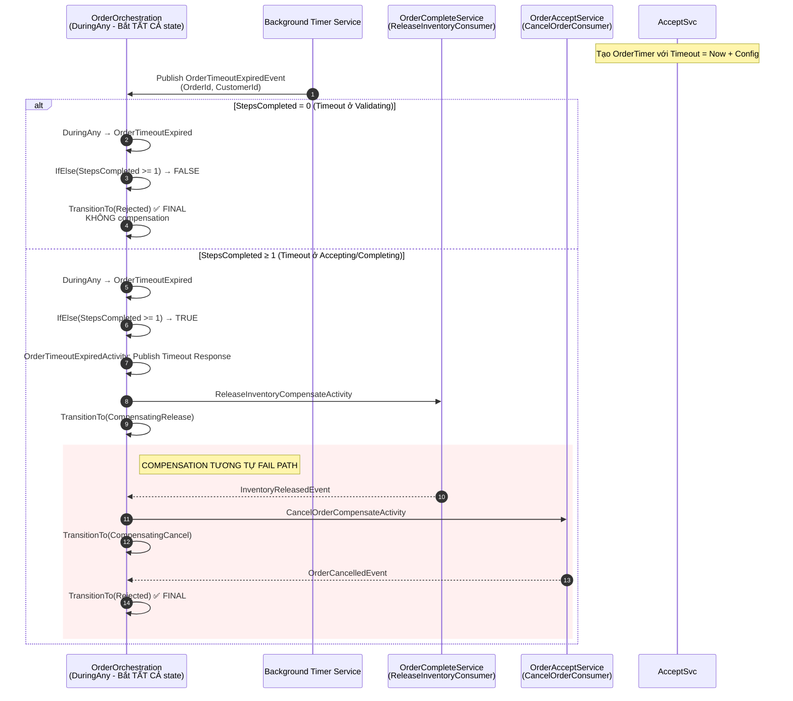
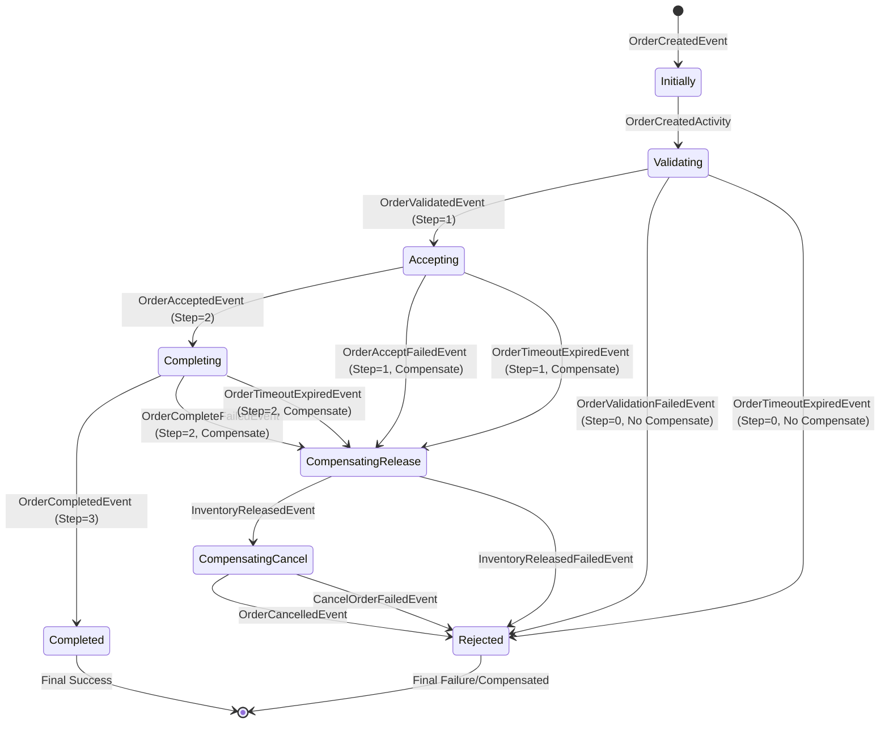

# Hệ Thống Saga Order - 4 Flow Chính (Mermaid)

---

## ✅ 1. HAPPY PATH - Thành Công Hoàn Toàn



---

## ❌ 2. FAIL PATH - Thất Bại Nghiệp Vụ

### 2.1 Fail tại Validate (Step 0 - Không compensation)



### 2.2 Fail tại Accept (Step 1 - Có compensation LIFO)



### 2.3 Fail tại Complete (Step 2 - Compensation LIFO đầy đủ)



---

## ⏱️ 3. TIMEOUT PATH - Hết Thời Gian Chờ



---

## 🔄 4. COMPENSATION PATH - Bồi Hoàn LIFO (Chi Tiết)

```mermaid
flowchart TD
    subgraph FAIL_TRIGGER["❌ Trigger Compensation (Fail/Timeout)"]
        A1[OrderAcceptFailedEvent] 
        A2[OrderCompleteFailedEvent]
        A3[OrderTimeoutExpiredEvent<br/>(StepsCompleted ≥ 1)]
    end

    subgraph ORCHESTRATOR["OrderOrchestration State Machine"]
        B1[During(Accepting/Completing/Any)<br/>IfElse StepsCompleted ≥ 1]
        B2[ReleaseInventoryCompensateActivity<br/>Send ReleaseInventoryCommand]
        B3[TransitionTo CompensatingRelease]
        B4[During CompensatingRelease<br/>Wait InventoryReleasedEvent]
        B5[CancelOrderCompensateActivity<br/>Send CancelOrderCommand]
        B6[TransitionTo CompensatingCancel]
        B7[During CompensatingCancel<br/>Wait OrderCancelledEvent]
        B8[TransitionTo Rejected FINAL]
    end

    subgraph RELEASE["ReleaseInventoryConsumer<br/>(OrderCompleteService)"]
        C1[Nhận ReleaseInventoryCommand]
        C2{IsReserved == true?}
        C3[Giảm ReservedQty cho từng item]
        C4[Order.IsReserved = false<br/>Order.Status = Accepted]
        C5[SaveChanges DB]
        C6[Publish InventoryReleasedEvent]
        C7[Bỏ qua (idempotent)<br/>Publish InventoryReleasedEvent]
    end

    subgraph CANCEL["CancelOrderConsumer<br/>(OrderAcceptService)"]
        D1[Nhận CancelOrderCommand]
        D2{Status == Accepted?}
        D3[Order.Status = Rejected<br/>RejectedAt = Now]
        D4[Timer.TimerStatus = Cancelled]
        D5[SaveChanges DB]
        D6[Publish OrderCancelledEvent]
        D7[Bỏ qua (idempotent)]
    end

    subgraph ERROR_HANDLING["Xử Lý Lỗi Compensation"]
        E1[InventoryReleasedFailedEvent<br/>→ Publish OrderAcceptFailedResponse<br/>→ TransitionTo Rejected]
        E2[CancelOrderFailedEvent<br/>→ Publish OrderAcceptFailedResponse<br/>→ TransitionTo Rejected]
    end

    FAIL_TRIGGER --> B1
    B1 --> B2
    B2 --> B3
    B3 --> C1
    C1 --> C2
    C2 -- Yes --> C3
    C3 --> C4
    C4 --> C5
    C5 --> C6
    C2 -- No --> C7
    C6 --> B4
    C7 --> B4
    B4 --> B5
    B5 --> B6
    B6 --> D1
    D1 --> D2
    D2 -- Yes --> D3
    D3 --> D4
    D4 --> D5
    D5 --> D6
    D2 -- No --> D7
    D6 --> B7
    D7 --> B7
    B7 --> B8
    B8 --> END([✅ Rejected Final])
    
    %% Error paths
    C1 -.->|Exception| E1
    D1 -.->|Exception| E2
    E1 --> B8
    E2 --> B8

    style FAIL_TRIGGER fill:#ffebee
    style ORCHESTRATOR fill:#e3f2fd
    style RELEASE fill:#fff3e0
    style CANCEL fill:#fff3e0
    style ERROR_HANDLING fill:#fce4ec
```

---

## 📋 Tóm Tắt State Transition Table



---

## 🔑 Key Points

| Flow | Trigger | Compensation | Final State |
|------|---------|--------------|-------------|
| **Happy** | Tất cả success | Không | `Completed` |
| **Fail Validate** | ValidationFailed | Không (Step=0) | `Rejected` |
| **Fail Accept** | AcceptFailed | ReleaseInv → Cancel | `Rejected` |
| **Fail Complete** | CompleteFailed | ReleaseInv → Cancel | `Rejected` |
| **Timeout (Step=0)** | TimeoutExpired | Không | `Rejected` |
| **Timeout (Step≥1)** | TimeoutExpired | ReleaseInv → Cancel | `Rejected` |

**LIFO Order:** Complete → Accept → Validate (ngược lại thứ tự thực hiện)
**Idempotency:** Mọi consumer đều check trạng thái trước khi xử lý (tránh duplicate/retry)
**Error in Compensation:** Nếu compensation fail → Saga dừng, publish error response, vẫn về `Rejected`